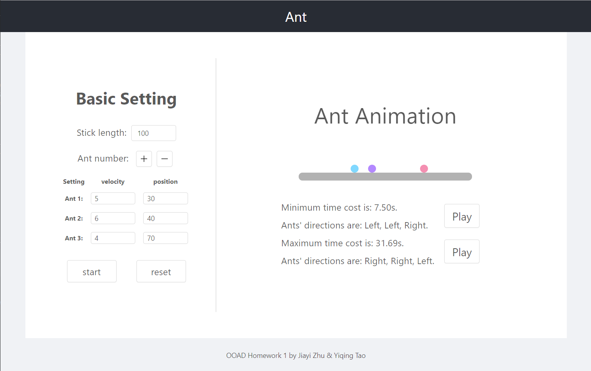

# Ant

This project aims to calculate minimum and maximun time of a settled number of ants with thier position on the stick.

## Instruction

- User can set the length of the stick, the number of ants and the position and velocity of each ants.

- The velocity of each ants can be in 2 - 9.

- Press `start` to get the minimum time and minimum time. The answer will be shown in the right panel.

- After get the minimum and maximun time, press `play` to see the animation.

## About Game

The backend of the game is implemented by `JAVA` with `SpringBoot`.

The fronend of the game is implemented by `React` with `Antd` UI.

The console folder is the game without UI version.

## Screenshot

