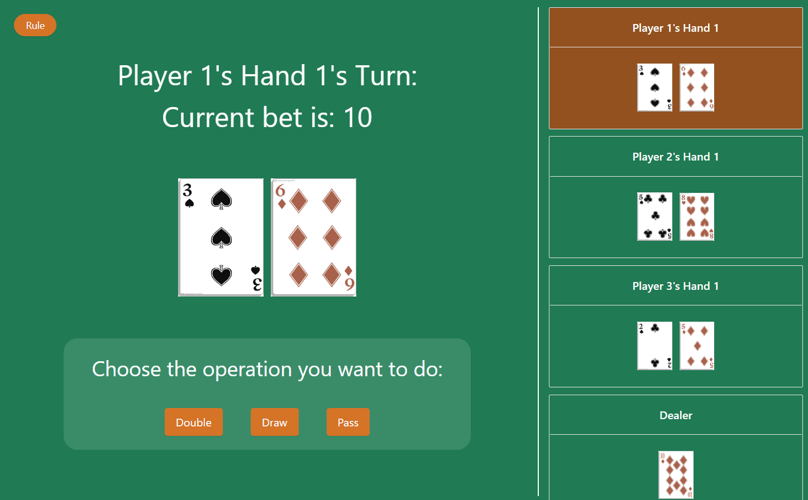
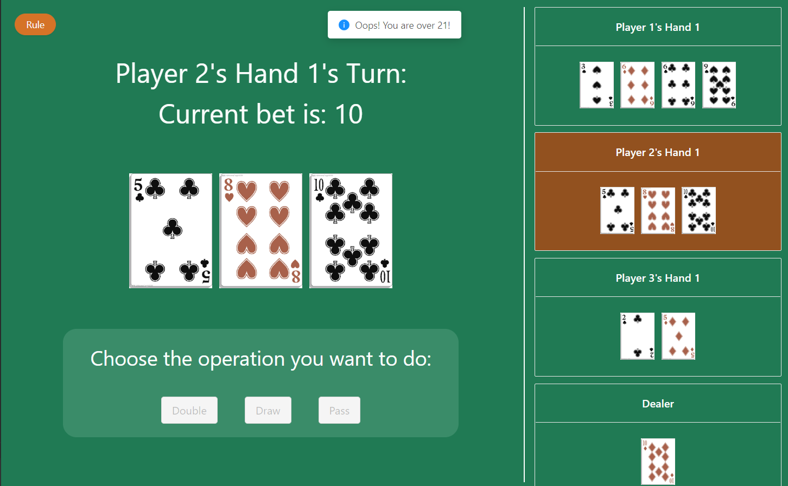
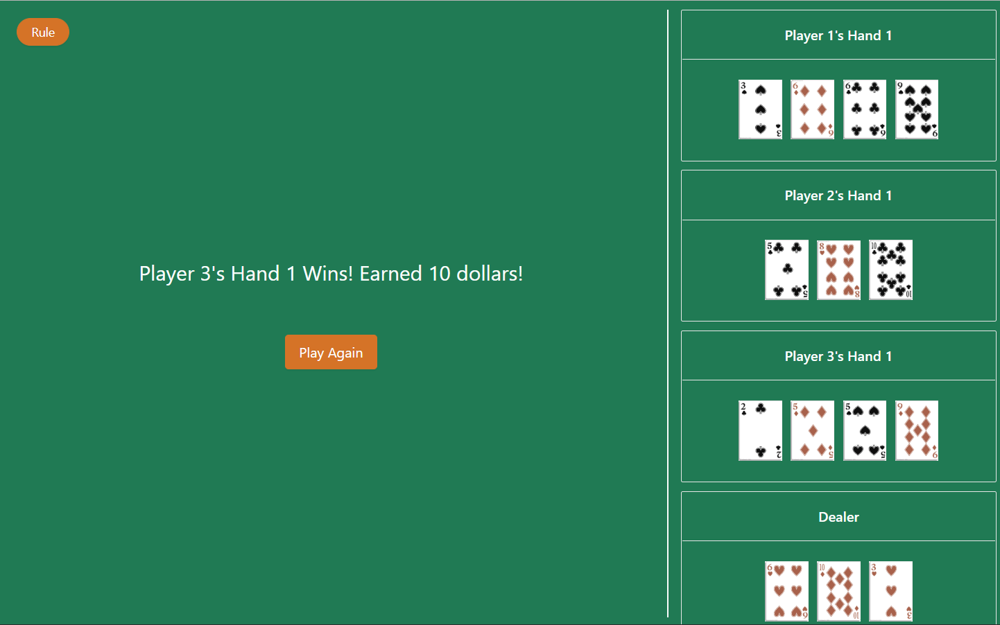

# BlackJack

In this game, user can get 2 - 5 cards and the goal is to make the sum of cards near 21 but not over 21.

## Instruction

- Each player plays against the computer.

- A player can have several hands, each hand plays against computer.

- Computer only have one hand.

- A player will bet for he / her all hands.
  If player wins, the player can get double of the bet.
  Otherwise, the player will lose the bet.

- In the game, 2 - 10 equals their own value.
  J, Q, K is 10.
  A is 1 or 11.

- When calculating the sum, the system will calculate the maximun sum that is not over 21 if the sum exists.

- The player will get 2 cards at first.
  Then, the player can decide to get a card or just pass.

- The player can have 5 cards at most.

- When player's sum equals computer's sum, the one with smaller number of cards wins.

- If the number of cards is also the same, the player wins.

## About Game

The backend of the game is implemented by `JAVA` with `SpringBoot`.

The fronend of the game is implemented by `React` with `Antd` UI.

## Screenshot

