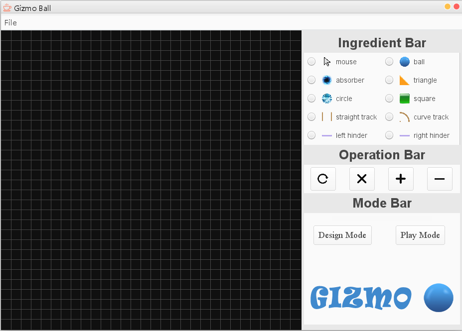
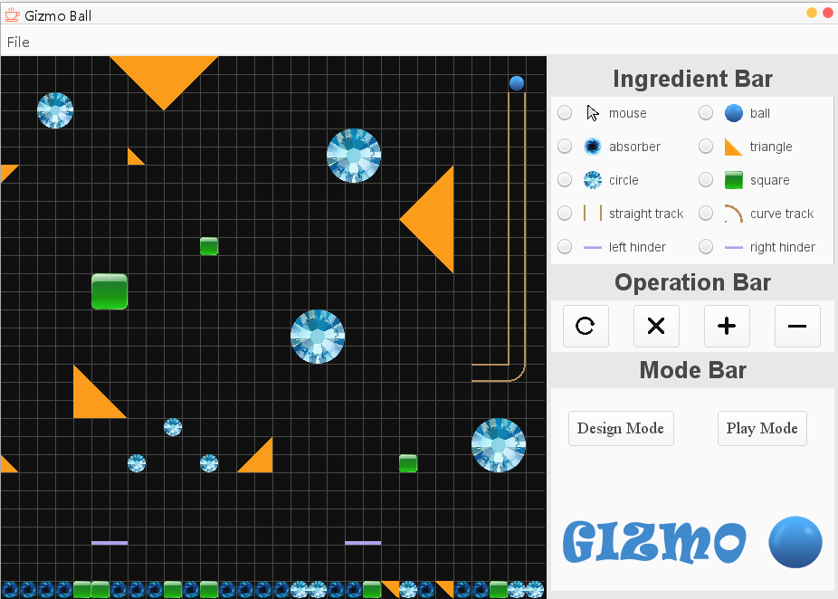

# Gizmo Ball
In this game, user can place obstacles and balls on the panel and then play the game.

## Instruction

### Design Mode

- User can choose the substance in the right panel and click on the left panel.
The substance will be put in the grid you clicked.

- All substance can only be added in the grid.

- The default size is one grid large except hinder which is two grids long can cannot be enlarged.

- A substance can only be put in the empty grid.

- Only one Left hinder and one right hinder can be put on the panel.

- User can rotate, delete, zoom in and zoom out a substance by first clicking the substance by the mouse.

### Play Mode

- All balls will move in the mode with some lost of speed after collision.

- User can control the left hinder by pressing **A** for left and **D** for right.

- User can control the right hinder by pressing **->** for left and **<-** for right.

- The ball will move along the track when it is on the track.

- If a ball goes to the absorber, the ball will vanish.

### File

- User can save game in the compuer.

- User can load saved game by choosing the saved file.

- When clicking new game, all infromation will be deleted.

## About Game

The game is implemented by `JAVA`. Physics engine is `jbox2d`.

## Screenshots

